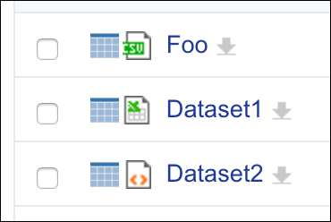

# About **listing-icon-both-types**

By default Nuxeo will display the icon returned by the Type service for a document in a Content View when you have the icon column. If the document has no binary, the document type icon is displayed. But if there is a binary, the icon for the binary is displayed. This widget will display the doc type icon in all cases, and display the binary icon only if it exists. It's a quick way for the user to distinguish the file type used in a listing of various entities. Note that this contribution overrides the icon behavior for everything, not just our custom types.

## Installation

Install `listing_icon_types_widget_template.xhtml` in the `Resources` section of the Nuxeo Studio project as a `Widget` template.

Install `xml-extension.xml` as an XML Extension.

## Support

**These features are not part of the Nuxeo Production platform.**

These solutions are provided for inspiration and we encourage customers to use them as code samples and learning resources.

This is a moving project (no API maintenance, no deprecation process, etc.) If any of these solutions are found to be useful for the Nuxeo Platform in general, they will be integrated directly into platform, not maintained here.

## Licensing

[Apache License, Version 2.0](http://www.apache.org/licenses/LICENSE-2.0)

## About Nuxeo

Nuxeo dramatically improves how content-based applications are built, managed and deployed, making customers more agile, innovative and successful. Nuxeo provides a next generation, enterprise ready platform for building traditional and cutting-edge content oriented applications. Combining a powerful application development environment with SaaS-based tools and a modular architecture, the Nuxeo Platform and Products provide clear business value to some of the most recognizable brands including Verizon, Electronic Arts, Sharp, FICO, the U.S. Navy, and Boeing. Nuxeo is headquartered in New York and Paris.

More information is available at [www.nuxeo.com](http://www.nuxeo.com).
