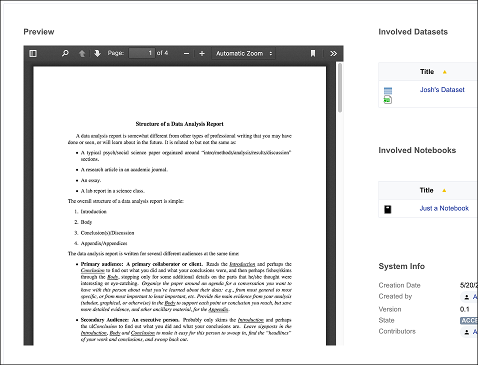

# About **pdf-preview-widget**

A widget that uses the [pdf.js](https://mozilla.github.io/pdf.js/) preview widget to display document previews.

## Installation

Install `pdf-js-preview.xhtml` in the `Resources` section of the Nuxeo Studio project as a `Widget` template.

## Limitations

There is no validation to test if a binary is actually available. If there is no binary to preview, or the binary is an incompatible type, an error will be displayed.

To hide the widget if there is no binary (for default types) you can use `#{not empty layoutValue.file.content?"view":"hidden"}` in the Advanced Settings for the widget.

## Support

**These features are not part of the Nuxeo Production platform.**

These solutions are provided for inspiration and we encourage customers to use them as code samples and learning resources.

This is a moving project (no API maintenance, no deprecation process, etc.) If any of these solutions are found to be useful for the Nuxeo Platform in general, they will be integrated directly into platform, not maintained here.

## Licensing

[Apache License, Version 2.0](http://www.apache.org/licenses/LICENSE-2.0)

## About Nuxeo

Nuxeo dramatically improves how content-based applications are built, managed and deployed, making customers more agile, innovative and successful. Nuxeo provides a next generation, enterprise ready platform for building traditional and cutting-edge content oriented applications. Combining a powerful application development environment with SaaS-based tools and a modular architecture, the Nuxeo Platform and Products provide clear business value to some of the most recognizable brands including Verizon, Electronic Arts, Sharp, FICO, the U.S. Navy, and Boeing. Nuxeo is headquartered in New York and Paris.

More information is available at [www.nuxeo.com](http://www.nuxeo.com).
