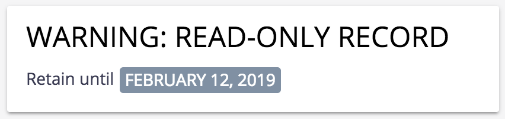

# About

Helpers to get you started with [nuxeo-retention](https://github.com/nuxeo-sandbox/nuxeo-retention)

* `retention.xml` has some sample retention rules
* `retention-action.html` is a WebUI action element to set a document as a "record"
* `retention-widget.html` is a custom element that displays some information about "records"

# Installation

Note: you'll probably want to install the operations from `nuxeo-retention` in your Studio registry.

* Install `retention.xml` as an XML Extension.
* Install `retention-action.html` and `retention-widget.html` in your WebUI resources and import them in your bundle
* Configure a WebUI action that uses `retention-action.html`
  * You need to specify the operation to call in the binding, e.g. `<retention-action operation="Retention_AddToFile" document="[[document]]"></retention-action>`
  * A sample chain is included in `Retention_AddToFile.yml`
* Add `<retention-widget>`'s to your layouts to display record data if desired for example:
  * `<retention-widget document="[[document]]"></retention-widget>`

# Usage

Click the defined action to mark a document as a record. This applies the `Record` facet and fills in the `record` schema on the document. A secuiorty policy is used to enforce the retention details.

IMPORTANT: `nuxeo-retention` does not override Administrator. Administrator can still edit for delete any content in the respository.

# Support

**These features are not part of the Nuxeo Production platform.**

These solutions are provided for inspiration and we encourage customers to use them as code samples and learning resources.

This is a moving project (no API maintenance, no deprecation process, etc.) If any of these solutions are found to be useful for the Nuxeo Platform in general, they will be integrated directly into platform, not maintained here.

# Licensing

[Apache License, Version 2.0](http://www.apache.org/licenses/LICENSE-2.0)

# About Nuxeo

Nuxeo dramatically improves how content-based applications are built, managed and deployed, making customers more agile, innovative and successful. Nuxeo provides a next generation, enterprise ready platform for building traditional and cutting-edge content oriented applications. Combining a powerful application development environment with SaaS-based tools and a modular architecture, the Nuxeo Platform and Products provide clear business value to some of the most recognizable brands including Verizon, Electronic Arts, Sharp, FICO, the U.S. Navy, and Boeing. Nuxeo is headquartered in New York and Paris.

More information is available at [www.nuxeo.com](http://www.nuxeo.com).
