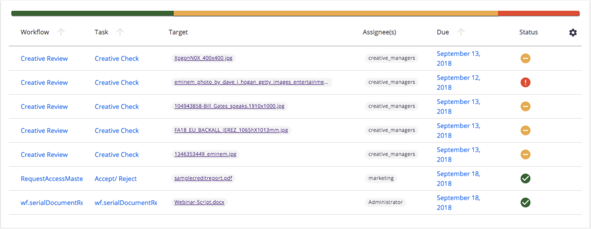

# About

Module for workflow status layout displayed in the "Analytics" area of Web UI.

Note: there is currently no data generation so this will only display real, running workflow tasks.

# Installation

1. Install WORKFLOW_STATUS.xml as an XML Extension
1. Install the script in the `automation` folder as an Automation Script
1. Install the content in the `ui` folder as Resources in Designer (including the subfolders)

# Configuration

## Modeler

* Create a Page Provider for workflow tasks
  * id: `workflow-status`
  * filter: `ecm:currentLifeCycleState = 'opened' AND ecm:primaryType = 'RoutingTask'`
    + Warning: delete the default filter, only use the above values

# Usage

* Admin -> Analytics -> Workflow Status

# Support

**These features are not part of the Nuxeo Production platform.**

These solutions are provided for inspiration and we encourage customers to use them as code samples and learning resources.

This is a moving project (no API maintenance, no deprecation process, etc.) If any of these solutions are found to be useful for the Nuxeo Platform in general, they will be integrated directly into platform, not maintained here.

# Licensing

[Apache License, Version 2.0](http://www.apache.org/licenses/LICENSE-2.0)

# About Nuxeo

Nuxeo dramatically improves how content-based applications are built, managed and deployed, making customers more agile, innovative and successful. Nuxeo provides a next generation, enterprise ready platform for building traditional and cutting-edge content oriented applications. Combining a powerful application development environment with SaaS-based tools and a modular architecture, the Nuxeo Platform and Products provide clear business value to some of the most recognizable brands including Verizon, Electronic Arts, Sharp, FICO, the U.S. Navy, and Boeing. Nuxeo is headquartered in New York and Paris.

More information is available at [www.nuxeo.com](http://www.nuxeo.com).
